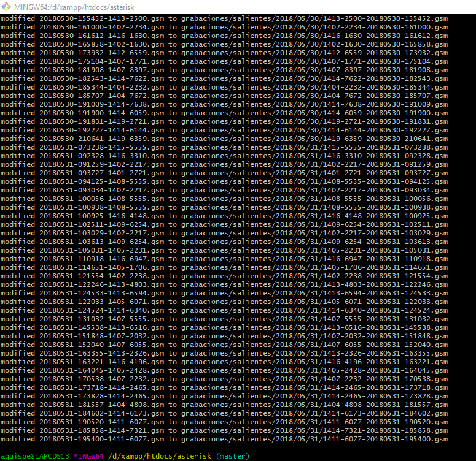
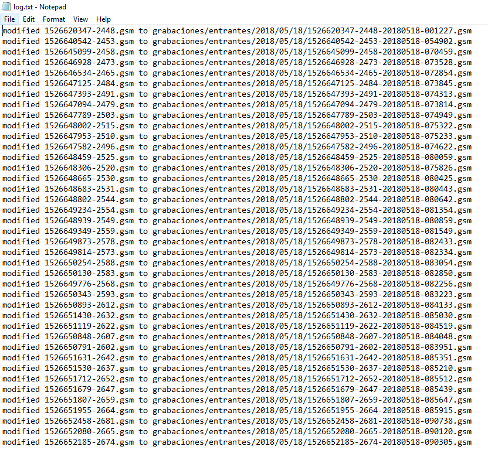

# Renombrar archivos por carpetas
Renombra los archivos multimedia, guarda en un log.txt el seguimiento y crea una carpeta moviendo los archivos perdidos o no ubicados en la base de datos SQL

## Imagenes
<table style="width:100%">
    <tr>
        <td width=30%></td>
        <td width=30%></td>
        <td width=40%></td>
    </tr>
</table>
